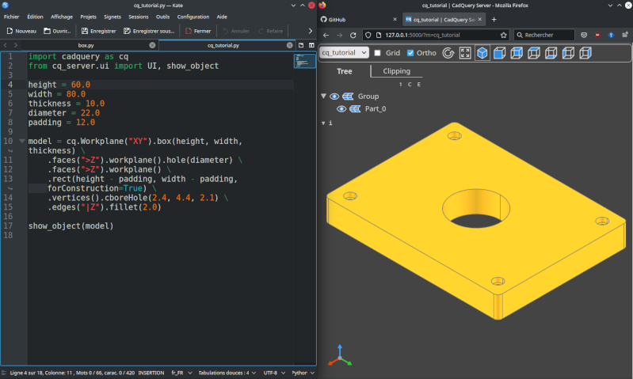

# CadQuery server

A web server used to render 3d models from CadQuery code loaded dynamically.

It has been created for the [Cadquery VSCode extension](https://open-vsx.org/extension/roipoussiere/cadquery), but can be used as standalone.

Example usage with Kate on the left and Firefox on the right:



## Features

- fast response time
- built-in file-watcher
- live-reload
- use your favorite text editor or IDE
- display model on an external monitor or other device
- compatible with VSCode built-in browser

Please note that the web server is intended for personal use and it's absolutely not safe to open it to a public network.

## Functionning

CadQuery Server dynamically loads your CadQuery code and renders the model on the browser using [three-cad-viewer](https://github.com/bernhard-42/three-cad-viewer) (the same used in [jupyter-cadquery](https://github.com/bernhard-42/jupyter-cadquery)). It includes a file watcher that reloads the Python code and updates the web page when the file is updated.

This approach allows users to work on any IDE, and render the model on any web browser. It also allow them to display the model in an other monitor, or even in an other computer on the same local network (for instance a tablet on your desktop).

The project was originally started for the VSCode extension, but since it doesn't depend on VSCode anymore, it's now a project as it own.

## Installation

If you already have CadQuery installed on your system:

    pip install cadquery-server

If you want to install both cq-server and CadQuery:

    pip install 'cadquery-server[cadquery]'

This may take a while.

## Usage

### Starting the server

Once installed, the `cq-server` command should be available on your system.

Use `cq-server -h` to list all available options.

Positional arguments:

- `dir`: Path of the directory containing CadQuery scripts (default: ".").

Main options:

- `-p`, `--port`: Server port (default: 5000);
- `-m`, `--module`: Default module to load (default: "main").

Example:

    cq-server ./examples -p 5000 -m box

This command will run the server on the port `5000` and load the `box.py` python file in the `./examples` directory. Note that the `-m` option can be overridden by url parameter if necessary (see below).

### UI cli options

Other cli options are available to change the UI appearence:

- `--ui-hide`: a comma-separated list of buttons to disable, among: `axes`, `axes0`, `grid`, `ortho`, `more`, `help`;
- `--ui-glass`: activate tree view glass mode;
- `--ui-theme`: set ui theme, `light` or `dark` (default: browser config);
- `--ui-trackball`: set control mode to trackball instead orbit;
- `--ui-perspective`: set camera view to perspective instead orthogonal;
- `--ui-grid`: display a grid in specified axes (`x`, `y`, `z`, `xy`, etc.);
- `--ui-transparent`: make objects semi-transparent;
- `--ui-black-edges`: make edges black.

Example:

    cq-server --ui-hide ortho,more,help --ui-glass --ui-theme light --ui-grid xyz

### Writing a CadQuery code

CadQuery Server renders the model defined in the `show_object()` function (like in CadQuery Editor).

You **must** import it before from the `cq_server.ui` module, among with the `UI` class, which is used by the server to load the model.

Minimal working example:

```py
import cadquery as cq
from cq_server.ui import UI, show_object

show_object(cq.Workplane('XY').box(1, 2, 3))
```

Please read the [CadQuery documentation](https://cadquery.readthedocs.io/en/latest/) for more details about the CadQuery library.

### Using the web server

Once the server is started, go to its url (ie. `http://127.0.0.1`).

Optional url parameters:

- `module`: name of module to load (default: defined in the `--module` cli option);

example: `http://127.0.0.1?module=box`).

Note that the `/json` endpoint is used internally and can be used for advanced use. It takes same parameters but returns the model as a threejs json object.

In VSCode, the web page can be displayed within the IDE using LivePreview extension (ctrl+shift+P -> Simple Browser: Show). This way you can use VSCode debugging tools.
